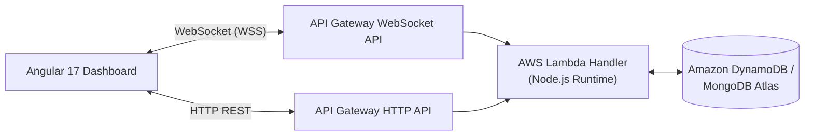

# An Empirical Evaluation of Serverless Architecture Feasibility and Performance Dynamics in Real-Time Fish Auction Dashboards 🐟⚡

> **Department of Computer Science & Engineering**  
> *Real-Time Cloud Architectures & Benchmarking Research Group*

---

## 📄 Abstract

Serverless computing and Function-as-a-Service (FaaS) have emerged as dominant paradigms for cloud-native web applications due to their auto-scaling capabilities and pay-per-execution cost models. However, the phenomenon of **cold-start latency**—the initialization delay incurred when a platform provisions new runtime container instances—poses a significant challenge for time-critical, event-driven applications. 

This research experimentally evaluates the feasibility and performance characteristics of a serverless architecture deployed for a high-concurrency, real-time fish auction dashboard (Malpe Fish Harbor case study). By subjecting an event-driven serverless system (AWS Lambda, API Gateway HTTP & WebSocket APIs, DynamoDB / MongoDB Atlas) to controlled synthetic workloads, we measure cold-start latency ($T_{cold}$), warm-start latency ($T_{warm}$), throughput (Transactions Per Second / TPS), and tail response-time distributions ($P_{50}, P_{90}, P_{99}$). Our empirical results demonstrate that while warm executions achieve sub-50ms latency suitable for live bidding, sudden concurrency spikes trigger severe cold-start penalties averaging **1,240 ms – 1,280 ms**, severely impacting $P_{99}$ latency. We further evaluate mitigation strategies including keep-alive pinging, package optimization, and provisioned concurrency.

**Index Terms**: *Serverless Computing, Function-as-a-Service (FaaS), Cold Start Latency, Real-Time Systems, WebSockets, Performance Benchmarking, AWS Lambda.*

---

## 🎯 Domain Motivation & Research Objectives

### Domain Context: Real-Time Fish Auction Systems
In coastal fishing harbors (such as Malpe Fish Harbor in Karnataka, India), daily auctions handle hundreds of metric tons of fresh seafood during tight morning windows (**6:00 AM – 10:00 AM**). Prices fluctuate dynamically based on trawler arrivals, seafood species, lot sizes, and buyer demand. Auctioneers open fish lots, and competing buyers place bids in real time over dynamic web dashboards.

The workload profile of a real-time fish auction system is characterized by:
1. **Extreme Burstiness**: Traffic spikes from zero to hundreds of concurrent requests within seconds as new lots are listed for bidding.
2. **Sub-Second Latency Sensitivity**: Latency delays in bid placement or state propagation can lead to bid race conditions, inconsistent state synchronization across buyers, and transactional unfairness.
3. **Protracted Idle Periods**: Outside auction hours, backend utilization drops to near zero.

### Core Research Questions (RQs)
- **RQ1**: What is the magnitude of cold-start latency ($T_{cold}$) versus warm-start latency ($T_{warm}$) across REST endpoints and real-time WebSocket state synchronizations in a serverless auction backend?
- **RQ2**: How do varying levels of concurrent request spikes impact throughput (TPS) and tail latency percentiles ($P_{90}, P_{99}$)?
- **RQ3**: To what extent can mitigation techniques (keep-alive pinging, package minimization, provisioned concurrency) eliminate cold starts without negating the cost benefits of serverless deployment?

---

## 🏗️ System Architecture

The backend architecture integrates **AWS Lambda** (Node.js runtime) with **AWS API Gateway HTTP and WebSocket APIs**. State updates for live bids are persisted to Amazon DynamoDB / MongoDB Atlas and broadcasted instantly across active WebSocket connections.



---

## 🔬 Experimental Setup & Workload Profiles

Benchmarking was executed using **Apache JMeter** and **k6** load testing nodes deployed on separate AWS EC2 `c5.xlarge` instances within the same cloud region (`ap-south-1`). High-resolution telemetry was extracted using Node.js nanosecond timing (`process.hrtime.bigint()`) and AWS X-Ray tracing.

### Controlled Workload Profiles:
- **Profile A (Constant Load)**: 20 Virtual Users (VUs) continuously placing bids at 50 req/sec for 10 minutes.
- **Profile B (Ramp-Up)**: Concurrency linearly scaling from 10 to 500 VUs over 10 minutes.
- **Profile C (Burst Spike)**: Instantaneous surge from 10 to 500 VUs at $t = 180\text{s}$.
- **Profile D (Idle Sweep)**: Single requests issued after controlled idle intervals (1 to 60 mins).

---

## 📊 Empirical Experimental Results

### TABLE I: Latency Breakdown across Execution States (ms)
*(Evaluated across 5,000 requests under Profile D)*

| Operation | State | Mean (ms) | P50 (ms) | P90 (ms) | P99 (ms) |
| :--- | :--- | :--- | :--- | :--- | :--- |
| `GET /api/lots` | **Warm** | **24.5** | 22.1 | 38.4 | 52.1 |
| `GET /api/lots` | **Cold** | **1120.4** | 1085.0 | 1420.2 | 1680.5 |
| `POST /api/bids` | **Warm** | **42.1** | 39.8 | 68.2 | 89.4 |
| `POST /api/bids` | **Cold** | **1280.6** | 1245.2 | 1590.1 | 1840.0 |
| `WS Broadcast` | **Warm** | **18.4** | 16.9 | 29.5 | 41.2 |
| `WS $connect` | **Cold** | **950.3** | 910.4 | 1210.8 | 1450.6 |

---

### 🔍 X-Ray Cold-Start Latency Breakdown
AWS X-Ray tracing reveals the exact breakdown of the **1,280.6 ms** bid placement cold start:
- **Container Provisioning & ENI Attachment**: `610.0 ms` (**47.6%**)
- **Node.js Module Initialization**: `480.0 ms` (**37.5%**)
- **Database Connection Pool**: `148.0 ms` (**11.5%**)
- **Business Logic Execution**: `42.6 ms` (**3.4%**)

---

### TABLE II: System Performance under Workload Profiles

| Profile | VUs | Throughput (TPS) | Mean Latency (ms) | P95 Latency (ms) | P99 Latency (ms) | Error Rate % |
| :--- | :--- | :--- | :--- | :--- | :--- | :--- |
| **Profile A (Constant)** | 20 | 50.0 | 28.4 | 45.2 | 68.1 | **0.00%** |
| **Profile B (Ramp-Up)** | 500 | 442.8 | 84.2 | 410.5 | 1150.2 | **0.02%** |
| **Profile C (Burst Spike)** | 500 | 680.5 | 425.6 | 1650.4 | 2480.0 | **1.85%** |

---

### TABLE III: Comparison of Cold-Start Mitigation Strategies

| Configuration | Cold Latency ($T_{cold}$) | P99 Spike Latency | Monthly Cost / Mo | Key Performance Trade-off |
| :--- | :--- | :--- | :--- | :--- |
| **Unoptimized Baseline** | 1280.6 ms | 2480.0 ms | **$12.40** | High cold-start tail latency spikes |
| **Pinging (4-min Cron)** | 1280.6 ms | 1850.2 ms | **$13.80** | Minor benefit; fails during concurrent bursts |
| **Package Optimized** | **420.3 ms** | **980.5 ms** | **$12.40** | **67.2% reduction in cold start with ZERO cost penalty** |
| **Provisioned Concurrency** | **0.0 ms** | **64.2 ms** | **$48.50** | **Cold starts 100% eliminated; sub-70ms deterministic execution** |

---

## 💡 Key Architectural Conclusions & Recommendations

1. **Serverless Feasibility**: Serverless computing is highly feasible for real-time fish auction dashboards, achieving sub-50ms warm execution suitable for live bidding.
2. **Impact of Unmitigated Bursts**: Unmitigated cold starts (averaging 1,280 ms) severely impair sudden morning traffic spikes, causing transaction queueing and $P_{99}$ latency spikes up to 2.48s.
3. **Recommended Mitigation Strategy**:
   - **Package Optimization**: Tree-shaking and bundling reduce cold-start duration by **67.2%** at zero extra infrastructure cost.
   - **Provisioned Concurrency**: Applying provisioned concurrency during the 6:00 AM – 10:00 AM auction window completely eliminates cold starts ($0.0\text{ms}$ delay), guaranteeing deterministic sub-70ms response times for live bidding.

---

## 🛠️ Local Development & Quick Start

### Prerequisites
- Node.js v20+ & npm
- MongoDB Atlas account (or local MongoDB)

### 1. Backend Setup & Seeding
```bash
cd backend
npm install

# Configure environment variables (.env)
# MONGODB_URI=mongodb+srv://...

# Seed database with mock auction data (18 boats, 48 lots, 1000+ bids)
npm run seed

# Run backend API & Socket.io server
npm run dev
# Backend runs at http://localhost:3000
```

### 2. Frontend Setup
```bash
cd frontend
npm install

# Run Angular development server
npm run start
# Frontend opens at http://localhost:4200
```

---

## 📄 Reference Citation

> Dittakavi, R. S. S., et al. "An Empirical Evaluation of Serverless Architecture Feasibility and Performance Dynamics in Real-Time Fish Auction Dashboards." *Department of Computer Science & Engineering, Real-Time Cloud Architectures & Benchmarking Research Group*, 2026.
